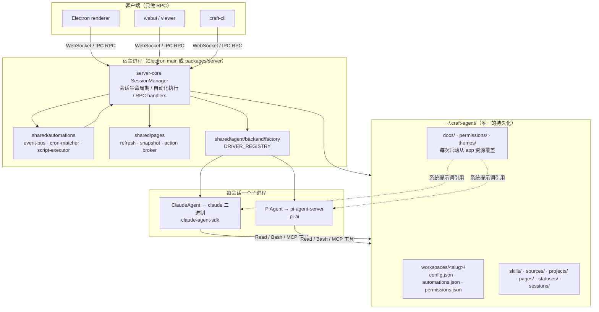
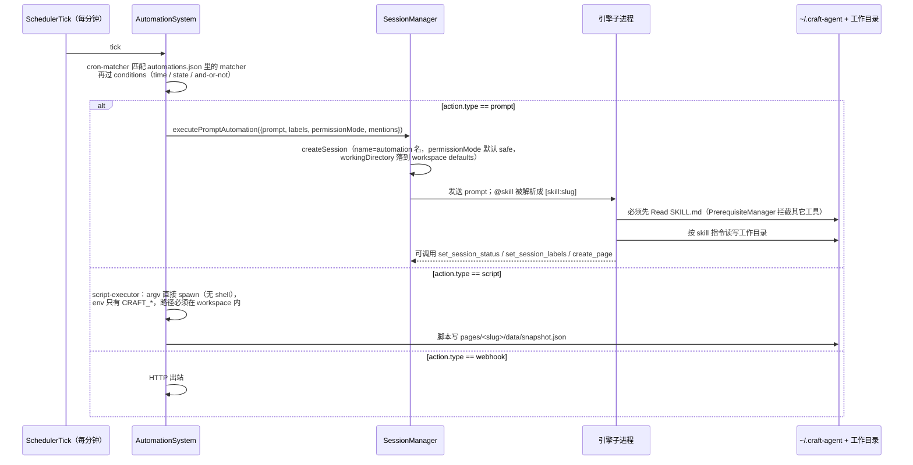

# Craft Agents（hexworkshop fork）源码分析报告

- 分析日期：2026-09-19
- 分析对象：`apps/hexworkshop`，等于上游 `craft-ai-agents/craft-agents-oss` v0.13.3（`zer/main` 仅多一个 docs commit）
- 分析目的：在它之上设计公众号发文工作流（选题 → 检查 → 排版 → 推草稿 → 数据回流），弄清哪些扩展点**不改源码**就能用
- 规模：1964 个入库文件，TypeScript 为主；采样式阅读（monorepo 大型仓库），重点读 `packages/shared`、`packages/server-core`、`apps/electron/resources/docs`

---

## 1. Project Thesis

**Craft Agents 的本质是一个"文件系统即数据库"的多会话 agent 收件箱，所有可扩展的东西都是 `~/.craft-agent/` 下的文件夹，agent 自己会读写这些文件夹。** 它不是一个"给 Claude 套壳的聊天窗"，而是把 Claude Agent SDK / pi 两个引擎藏在一个统一的 `AgentBackend` 接口后面，把 Skills、Sources、Automations、Pages、Statuses、Labels 全部定义为纯文件（`SKILL.md`、`config.json`、`automations.json`、`page.json`），并把这些文件的**使用说明也当成文件**打包进 app（`apps/electron/resources/docs/*.md`，每次启动同步到 `~/.craft-agent/docs/`），系统提示词里明确告诉模型"创建 X 之前先读 `docs/X.md`"。

这带来一个对二开极其友好的后果：**要给它加能力，第一选择永远是往文件夹里放文件，而不是改 TypeScript。** 官方 README 里"告诉 agent 帮你导入 Claude Code skills"不是代码功能——源码里没有任何 `.claude/skills` 的引用（`git grep` 只命中 release notes），它就是 agent 读了 `docs/skills.md` 后自己 `cp` 文件。

上游节奏：仅 2026-06 以来 15 个 tag、一周一 release；提交作者 84/106 是 `github-actions[bot]`——**公开仓库是内部仓库的 OSS 导出镜像**，PR 上游的流程要按 `CONTRIBUTING.md` 走但合并节奏由内部决定。

## 2. Repository Shape

Bun workspaces monorepo，`apps/*` 是可运行端，`packages/*` 是共享层。依赖方向严格是 `apps → server-core → shared → core`。

| 层 | 包 | 职责 | 文件数 |
|---|---|---|---|
| 可运行端 | `apps/electron` | 桌面主界面（主进程 / preload / renderer），也是 bundled resources（docs、permissions、themes）的来源 | 910 |
| | `apps/cli` | `craft-cli`，WebSocket 瘦客户端，连 headless server | 9 |
| | `apps/webui` `apps/viewer` | Web 端与只读分享查看器 | 35 |
| 服务层 | `packages/server-core` | `SessionManager`（9023 行，全系统的心脏）、RPC handlers、transport、automations 运行时、pages 执行 | 122 |
| | `packages/server` | headless 入口：`bun run packages/server/src/index.ts`，`CRAFT_SERVER_TOKEN` 鉴权，可 TLS | 4 |
| 共享领域层 | `packages/shared` | agent 后端（Claude / pi）、config、workspaces / projects / sessions / sources / skills / automations / pages / statuses / labels 的类型与存储 | 485 |
| | `packages/core` | renderer 安全的纯类型（`Page`、`StoredMessage` 等） | 15 |
| 工具与旁路 | `packages/session-tools-core` | 会话内工具（`spawn_session`、`set_session_status`、`create_page`、`call_llm`…） | 57 |
| | `packages/pi-agent-server` | pi 引擎的子进程服务 | 38 |
| | `packages/messaging-gateway` `messaging-whatsapp-worker` | Telegram / WhatsApp 网关 | 59 |
| | `packages/ui` | 共享 React 组件 | 180 |

## 3. Tech Stack

| 类别 | 选型 | 为什么重要 |
|---|---|---|
| 运行时 / 包管理 | Bun（`bunfig.toml`、`bun.lock`） | 脚本动作（automation `script` / page `refresh`）默认 runtime 也是 bun，且 Pages 的私有存储用 `bun:sqlite`——想用 Python 写刷新脚本可以（`python3` 在允许列表），但会失去 sqlite 工作区 |
| Agent 引擎 A | `@anthropic-ai/claude-agent-sdk` 0.3.258 | spawn 原生 `claude` 二进制（`claude-agent-sdk-binary` 别名），走 `CLAUDE_CODE_OAUTH_TOKEN` 或 `ANTHROPIC_API_KEY`；`plugins: []`——**没有用 SDK 的 Skill/plugin 机制**，skill 用"read-before-execute"自己实现 |
| Agent 引擎 B | `@earendil-works/pi-ai` / `pi-agent-core` / `pi-coding-agent` 0.85.1 | 非 Anthropic provider（openai-codex、openrouter、google、ollama…）全走这里；跑在**独立子进程**（`pi-agent-server`），工具以 proxy 方式注册回主进程 |
| 桌面 | Electron + React 18 + Vite + Tailwind v4 + shadcn/Radix + Jotai + i18next | `asar: false`；i18n 有 parity / sorted / coverage 三道 lint，改 UI 文案成本高 |
| 定时 | `croner` | `SchedulerTick` 每分钟一次，5 字段 cron + IANA 时区 |
| 数据校验 | `zod` ≥4、`gray-matter` | SKILL.md frontmatter 用 gray-matter，只强制 `name` + `description`——**与 Claude Code skill 格式兼容** |
| MCP | `@modelcontextprotocol/sdk` | Sources 的 mcp 类型；API 类型 source 用 SDK 的 `createSdkMcpServer` 造一个进程内 `api_{name}` 工具 |
| 打包 | electron-builder，`publish.provider: generic` → `thecraftagents.com/electron/latest` | 自建包必须删 `app-update.yml`，否则被拉回官方版（详见 fork `AGENTS.md`） |

## 4. Architecture Design

### 4.1 模式

**模块化单体 + 每会话一个引擎子进程。** 主进程（Electron main 或 headless `server`）持有 `SessionManager`；每个会话按 LLM connection 选驱动（`DRIVER_REGISTRY = { anthropic, pi }`，`packages/shared/src/agent/backend/factory.ts`），Claude 驱动 spawn `claude` 二进制，pi 驱动 spawn `pi-agent-server`。渲染端（Electron renderer / webui / cli）只是 RPC 客户端，**同一套 server-core 同时服务桌面和 headless**，这就是"桌面端可作瘦客户端连远程"的来源。

### 4.2 层次



### 4.3 执行流

- 开发：`bun run electron:dev`（热更新）/ `electron:start`。自动更新只在 `app.isPackaged` 时启用（`apps/electron/src/main/index.ts:1136`），开发模式无风险。
- headless：`CRAFT_SERVER_TOKEN=… bun run packages/server/src/index.ts`，或 `Dockerfile.server`；`scripts/install-server.sh` 生成 token。
- 校验：`bun run validate:ci` = `typecheck:all` + `test:shared:all` + `test:doc-tools` + 三道 i18n lint。CI 只有这一条 job（`.github/workflows/validate.yml`）。
- `docs/cli.md` 里的 clone 地址写的是 `anthropics/craft-agents`——文档比仓库迁移慢，不要照抄。

### 4.4 一次自动化触发的数据流（与本项目最相关）



## 5. Core Modules

### 5.1 Workspace 目录布局 `packages/shared/src/workspaces/`、`config/paths.ts`

**所有状态都在 `~/.craft-agent/workspaces/<slug>/` 下，没有数据库。** `CRAFT_CONFIG_DIR` 可整体改根目录（多实例开发用 `~/.craft-agent-1`）。

```
~/.craft-agent/
  docs/  permissions/  themes/  tool-icons/  config-defaults.json   ← 每次启动从 app 覆盖，不要手改
  workspaces/<slug>/
    config.json          defaults.{model, permissionMode, workingDirectory, enabledSourceSlugs, thinkingLevel}
    automations.json     { automations: { SchedulerTick: [...], LabelAdd: [...], ... } }
    permissions.json     allowedBashPatterns / allowedMcpPatterns / allowedApiEndpoints / allowedWritePaths
    .claude-plugin/plugin.json   由 ensurePluginManifest 自动生成
    skills/<slug>/SKILL.md
    sources/<slug>/{config.json, guide.md, permissions.json}
    projects/<slug>/{config.json, assets/, MEMORY.md}
    pages/<slug>/{page.json, index.html, data/{snapshot.json, store.sqlite}}
    statuses/config.json
    sessions/<id>/session.jsonl   首行 header，其后每行一条消息
```

**后果**：workspace 目录可以整个 `git init` 版本化（sessions 除外）——发文工作流的 automations / skills / pages 配置可以放进 meta-repo 追踪，再软链到这里。

### 5.2 Skills `packages/shared/src/skills/`、`agent/base-agent.ts:916-1025`

**三层目录、按 slug 覆盖、显式 @ 调用、读前禁用工具。**

- 加载顺序（低→高）：`~/.agents/skills/` → `<workspace>/skills/` → `<projectRoot>/.agents/skills/`。注意是 **`.agents`** 不是 `.claude`（`storage.ts:31-36`）。projectRoot = 会话的 working directory。
- 调用方式：用户或 automation prompt 里写 `@slug`，被解析为 `[skill:slug]`，`extractSkillPaths` 解出 `SKILL.md` 绝对路径塞进消息，`PrerequisiteManager.registerSkillPrerequisites` **阻塞所有其它工具直到模型读过该文件**（`base-agent.ts:1022-1025`）。
- **没有按 description 自动触发**：系统提示词（`prompts/system.ts:659-671`）只讲"用户用 `[skill:slug]` 提到时怎么做"。Claude Code 里"1% 可能就自动用 skill"的行为在这里不存在——工作流每一步该用哪个 skill必须在 prompt 里点名。
- frontmatter 兼容 Claude Code；多出 `requiredSources`（调用时自动启用某些 source）、`alwaysAllow`（skill 激活时放行的工具）、`globs`。
- 5 分钟缓存（`skillsCache`），新加 skill 后要等或触发 `invalidateSkillsCache`。

**对发文工作流的直接结论**：在 meta-repo 根目录做 `ln -s .claude/skills .agents/skills`，所有现有 skill（`content-deconstruct`、`xhs-precheck`、`zerspace-illustrations`、未来的 `wechat-publish`）就是 project 级 skill，零复制零源码改动。`~/.claude/plugins/` 里的 dbs-* 不在任何一层，需要软链进 `~/.agents/skills/` 或 workspace `skills/`。

### 5.3 Sources `packages/shared/src/sources/`

**三种类型：`mcp`（http/sse/stdio）、`api`（一个通用 HTTP 工具）、`local`（本地路径提示）。** 配置在 `sources/<slug>/config.json`，用法写在 `guide.md`，**模型被要求先读 guide.md 再用工具**（`pi-agent.ts:1419`，Claude 侧同样有 prerequisite）。

`api` 类型的实现是 `api-tools.ts:createApiTool`：为每个 source 造一个 `api_<name>` 工具，入参 `{path, method, params, _intent}`，自动注入鉴权（bearer / header / query / basic / oauth），支持 `_rawBody` 发非 JSON 体，**不支持 multipart 文件上传**（全文无 `FormData`）。有 `renewEndpoint` 机制但设计是"拿旧 token 换新 token"（`{{token}}` 占位），与微信"appid+secret 换 access_token"不匹配。

**对发文工作流的直接结论**：公众号 API 作为 `api` source 只适合**只读 JSON 调用**（查草稿列表、查素材）；`draft/add` 前必须先 `media/uploadimg` / `material/add_material` 上传封面，这是 multipart——**推草稿必须走自己的 CLI（`mp-kit`）+ Bash 工具**，不能靠 source。

### 5.4 Automations `packages/shared/src/automations/`、`server-core/.../SessionManager.ts:8475`

**事件 × matcher × 动作，配置是一个 JSON 文件。**

- 事件两类：App 事件（`LabelAdd/Remove`、`SessionStatusChange`、`FlagChange`、`PermissionModeChange`、`SchedulerTick`）和 Agent 事件（透传 SDK hooks：`PreToolUse`、`Stop`、`SessionEnd`…）。
- matcher：`cron`（仅 SchedulerTick）或 `matcher` 正则；`conditions` 支持 time（时段/星期/时区）、state（字段 value / from→to / contains）、and/or/not；`permissionMode`、`labels`、`enabled`、`telegramTopic`。
- 三种动作：
  - `prompt`：**新建一个会话**发 prompt（`executePromptAutomation`）。可指定 `llmConnection`、`model`、`thinkingLevel`；`@skill` 会被解析。**不能指定 workingDirectory / projectId**——落到 workspace `defaults.workingDirectory`（`SessionManager.ts:1918, 2562`）。permissionMode 默认 `safe`（只读），要写文件必须在 matcher 上显式给 `ask` 或 `allow-all`。
  - `script`：spawn workspace 内脚本（bun/node/python3），无 shell、env 只含 `CRAFT_*`、同 matcher 不并发、超时 1s–15min。可绑定 `page` 刷新。
  - `webhook`：出站 HTTP。
- 自带 `history-store`、`retry-scheduler`、`event-logger`。

**对发文工作流的直接结论**：
1. 一个 workspace 只能有一个默认 workingDirectory，所以**发文 workspace 的 workingDirectory 就设为 meta-repo 根**，所有 automation 会话天然在里面干活。
2. 可以用 **label / status 做流水线状态机**：给会话打 `ready-to-publish` 标签 → `LabelAdd` matcher 触发 `prompt: "@wechat-publish 处理本会话产出的文章"`；不需要写任何调度代码。
3. 数据回流用 `script` 动作 + Pages（见 5.5），不进 LLM。

### 5.5 Pages `packages/core/src/types/page.ts`、`shared/src/pages/`

**agent 写的 HTML 小仪表盘，数据由定时脚本写盘，宿主在沙箱 iframe 渲染。** `page.json` 里的 `refresh: {cron, script, runtime}` 会被物化成一个只含 `script` 动作的 cron matcher——**从不为刷新起 agent 会话**。脚本唯一的跨进程契约是 `data/snapshot.json`（`{kv, series}`），私有工作区 `store.sqlite`。页面里对 API source 的调用要经过 grant（按 path 正则授权、绑定内容摘要、有过期）。会话工具 `create_page` / `update_page` / `write_page_data` 让模型自己建页面。

**对发文工作流的直接结论**：公众号数据分析 = 一个 Page：刷新脚本读你导出的 xlsx（放在 workspace 内某目录），写 snapshot（每篇阅读/分享/完读率 series），`index.html` 画图。零 LLM 成本、零源码改动。

### 5.6 权限模型 `agent/mode-types.ts`、`agent/permissions-config.ts`

三档：`safe`（UI 叫 Explore：Write/Edit/MultiEdit/NotebookEdit 硬编码禁用，Bash 只放行只读模式，MCP 只放行只读正则）/ `ask` / `allow-all`（Execute）。**Claude 侧不用 SDK 的 `canUseTool`，全部在 `PreToolUse` hook 里判**（`claude-agent.ts:1583-1588`），所以 pi 侧能复用同一套规则。可配置层级：app 默认（`~/.craft-agent/permissions/`，启动覆盖）< workspace `permissions.json` < source `permissions.json`；字段 `allowedBashPatterns`（带注释）、`allowedMcpPatterns`、`allowedApiEndpoints`（方法+路径级）、`allowedWritePaths`（Explore 模式下允许写的 glob）。

**对发文工作流的直接结论**：定时任务想在 `safe` 模式跑又要写 `topics.md`，把 `docs/content-ops/**` 加进 workspace `allowedWritePaths`；`mp-kit push` 加进 `allowedBashPatterns`——不用把整条流水线放到 `allow-all`。

### 5.7 SessionManager `packages/server-core/src/sessions/SessionManager.ts`（9023 行）

**唯一的 god object。** 会话 CRUD、引擎创建、消息流、标题生成、自动化执行、分支、远程转移、Telegram 绑定、Kanban 任务都在这一个类里。上游自己也在往 `sessions/`、`tasks/` 子模块拆，但主体仍在。**任何触碰会话生命周期的二开都会撞进这个文件**，也是 merge 冲突概率最高的地方——这是"不改源码"原则最需要守住的位置。

## 6. Distinctive Design Decisions

1. **文档即 API。** 18 份 `resources/docs/*.md`（6447 行）每次启动覆盖到 `~/.craft-agent/docs/`，系统提示词的"Configuration Documentation"表告诉模型创建/修改 sources、automations、pages、skills 之前先读哪份。后果：**新增一种"能力"可以只靠写一份 md**，模型就会按它操作文件；也意味着上游改文档格式就等于改 API。
2. **Skill 读前禁工具，而不是注入系统提示。** 不用 SDK plugin，不把 SKILL.md 内容塞进 prompt；用 `PrerequisiteManager` 让模型自己 Read。后果：skill 体积不占系统提示词、两个引擎行为一致；代价是没有自动触发，且每次调用多一次工具往返。
3. **两个引擎、一套工具契约。** `session-tools-core` 定义约 30 个会话工具（`spawn_session`、`set_session_status`、`create_task`、`call_llm`、`browser_tool`…），Claude 侧作为 SDK MCP 工具注册，pi 侧作为 proxy 工具注册到子进程（`pi-agent.ts:584-627`），有 `session-tool-parity.test.ts` 保证两边一致。后果：换模型不换工作流；代价是 pi 侧的 MCP / API source 代理仍标 TODO（`pi-agent.ts:1454-1455`）——**pi 引擎下 Sources 可能不可用**，用 Codex 跑发文流水线前要验证。
4. **Automation 的 prompt 动作 = 新会话，不是在旧会话续聊。** 每次触发都是一张新卡片进收件箱，`triggeredBy` 标记，跳过 AI 起名。后果：流水线天然"一篇文章一张卡"，状态用 status/label 表达；代价是跨触发的上下文只能靠文件（`topics.md`、`MEMORY.md`）传递。
5. **脚本动作零信任。** argv spawn、只透传 `CRAFT_*` 环境变量、路径不得越出 workspace、同 matcher 串行。后果：`mp-kit` 如果以 script 动作跑，AppSecret 必须通过 `CRAFT_WH_*` 或 workspace 内文件传入，不能靠 shell profile 的普通变量。
6. **Project 是 workspace 内的"上下文包"而非隔离边界。** `projects/<slug>/` 只有 config + assets + MEMORY.md，会话可选绑定；Kanban 列每 project 可自定义。后果：一个 workspace（meta-repo）下可以按"公众号 / 小红书 / X"开多个 project 分别配 Kanban 列和 MEMORY.md，共享同一批 skills 和 sources。
7. **OSS 仓库是导出镜像。** commit 几乎全是 bot，一 tag 一 commit。后果：`git blame` 无信息，上游 PR 的评审在你看不见的地方发生，给上游提 PR 要有"可能被内部重写后以别的形式合入"的预期。

## 7. Quality Signals & Risks

### 测试
401 个测试文件，`packages/shared` 占 175，automations 子模块几乎每个文件配一个 `.test.ts`（cron-matcher、conditions、script-executor、security、sdk-bridge…）——**恰好是本项目最依赖的部分测试最密**。`SessionManager` 9023 行只有 server-core 下 36 个测试文件覆盖，UI 组件测试稀薄。

### CI
单 job：`bun install --frozen-lockfile` + `bun run validate:ci`（typecheck 全包 + shared 关键测试 + Python 文档工具 smoke + i18n 三道 lint）。没有 e2e，没有 electron 打包验证。

### 文档
对 agent 的文档远好于对开发者的文档：`resources/docs/` 6447 行 vs 根目录 `docs/` 只有一份 `cli.md`（且 clone 地址过期）。`apps/electron/CLAUDE.md` 是最好的开发者入门材料。

### 卫生
TODO/FIXME 仅 19 处（对 1964 文件而言极少），说明内部有另一套 issue 跟踪。超大文件：`SessionManager.ts` 9023、`AppShell.tsx` 3932、`browser-pane-manager.ts` 3613、`claude-agent.ts` 3175、`pi-agent.ts` 2719。

### 风险表

| 风险 | 严重度 | 证据 | 对本项目的影响 / 对策 |
|---|---|---|---|
| Claude 订阅 OAuth 经第三方 SDK 使用的计费与政策口径 | 高 | `apps/electron/CLAUDE.md` §2 直接设置 `CLAUDE_CODE_OAUTH_TOKEN` | 以实际账单为准；备选 API key 或 Codex OAuth |
| pi 引擎下 MCP / API source 代理未完成 | 中 | `pi-agent.ts:1454-1455` 标 TODO | 发文流水线先只在 Claude connection 上验证；Codex 只跑纯文件操作 |
| 一周一 release、SessionManager 巨型文件 | 中 | git tag 节奏；9023 行 | 严守"不改源码"，冲突面≈0 |
| 自动更新覆盖自建包 | 中 | `electron-builder.yml` `publish.provider: generic` | 打包后删 `app-update.yml`（已写进 fork AGENTS.md） |
| Skills 5 分钟缓存 + 无自动触发 | 低 | `storage.ts` skillsCache；`system.ts:659` | prompt 里显式 `@skill`；新加 skill 后重开会话 |
| `api` source 无 multipart | 低 | `api-tools.ts` 全文无 FormData | 推草稿走 CLI |
| 自动化 prompt 会话不能指定 workingDirectory | 低 | `executePromptAutomation` 参数表 | workspace 默认目录设为 meta-repo 根 |
| 文档与仓库漂移（`docs/cli.md` 指向 `anthropics/craft-agents`） | 低 | `docs/cli.md:16` | 以源码为准 |

### 商业与复用
Apache-2.0：可商用、可闭源衍生、可再分发，需保留 `LICENSE` / `NOTICE`，含专利授权。**商标另有限制**（`TRADEMARK.md`）：fork 不得使用 "Craft" / "Craft Agents" 名称与 logo，只能说 "Fork of Craft Agents"——本仓库叫 hexworkshop 正是为此；对外分发安装包前需改 `productName` / `appId` / 图标。

## 8. Unknowns Worth Verifying

1. **pi（Codex）引擎能否使用 project 级 skill 与 Bash 工具完成一次完整发文**——静态看 skill 解析在 `BaseAgent` 共享层，应当可以；MCP/API source 代理是 TODO，需实跑。
2. **`safe` 模式 + `allowedWritePaths` 是否对 Claude 引擎的 Write 工具生效**，还是仅放行 Bash 写入——`MergedPermissionsConfig.blockedTools` 说 Write 类硬编码禁用，`allowedWritePaths` 的实际语义要看 `PreToolUse` 判定代码。
3. **`LabelAdd` matcher 的正则匹配的是 label id 还是显示名**，以及 `state` 条件里 `labels` 字段的 `contains` 语义——决定"打标签触发发布"的配置写法。
4. **Pages 刷新脚本用 `python3` runtime 时 `CRAFT_PAGE_*` 环境变量与 snapshot 写入约定**是否与 bun 一致——影响 xlsx 解析用 openpyxl 还是 bun 的 xlsx 库。
5. **Claude Pro/Max OAuth 在本 app 内的实际用量归属**（订阅额度 vs extra usage）。
6. **workspace 目录纳入 git 后，`sessions/` 与 `.claude-plugin/` 的排除是否足够**，`config.json` 里是否有机器相关绝对路径导致跨机不可移植。

---

## 附：对"公众号发文工作流"的落位建议（由以上分析直接推出）

| 流水线环节 | 用什么扩展点 | 改源码？ |
|---|---|---|
| 选题（从 `topics.md` 挑） | `SchedulerTick` cron → `prompt` 动作 `@wechat-publish pick`，会话在 meta-repo 根 | 否 |
| 正文（人写） | 会话即卡片；Kanban 列：待写 / 写作中 / 待检 / 待发 / 已发 | 否 |
| 检查（AI 味、风险、标题摘要） | `wechat-publish` skill 内点名 `@dbs-ai-check` `@dbs-content-risk-check`（软链进 `~/.agents/skills/`） | 否 |
| 排版 + 封面 | 同一 skill 调 `@dbs-wechat-html` `@zerspace-illustrations` | 否 |
| 推草稿箱 | `LabelAdd: ready-to-publish` → `prompt` 动作 → skill 执行 `mp-kit push`（Bash，放进 `allowedBashPatterns`） | 否 |
| 数据回流 | Page `wechat-stats`：cron `script` 读 xlsx 写 snapshot | 否 |
| 远程固定 IP（白名单） | headless server 跑在 VPS，桌面端连 `wss://` | 否 |

需要写的新东西只有两件：`wechat-publish` 的 `SKILL.md`（放 meta-repo `.claude/skills/`，经软链被识别）和 `tools/mp-kit` CLI。

## 附二：官方文档（thecraftagents.com/docs）对照与补充（2026-09-19）

读了 introduction / skills / browser / api-discovery / rich-output / automations / permissions / working-directory / kanban / tasks / labels auto-rules / server headless / environment-variables。**文档整体落后源码半个版本**，以下按"文档说 / 源码是"记录：

| 主题 | 文档说 | 源码（v0.13.3）是 | 采信 |
|---|---|---|---|
| Skill 目录层级 | 两层：workspace + 内置 | 三层：`~/.agents/skills/` < workspace < `<cwd>/.agents/skills/`（Issue #171） | 源码 |
| Skill `globs` 自动激活 | "匹配文件模式时自动激活" | `globs` 只被解析进 `SkillMetadata`，运行时**没有任何引用** | 源码：不存在自动激活 |
| 上下文文件 | 只提 CLAUDE.md "自动注入" | `CONTEXT_FILE_PATTERNS = ['agents.md','claude.md']`，大小写不敏感、递归发现（monorepo），**列在系统提示词里让模型自己 Read**（为了压缩后仍在） | 源码：AGENTS.md 一等公民 |
| Automation 动作 | `command`（shell）+ `prompt`；`"version": 2` | `prompt` + `webhook` + `script`（argv spawn，**无 shell**）；`version` 可选 | 源码 |
| `allowedWritePaths` | Explore 模式下允许写入匹配 glob 的文件 | 类型里有，判定逻辑未读 | 文档（解决了"未知项 2"，仍需实跑） |
| Explore 模式 Bash | 安全命令也**禁止** `&&` `\|\|` `;` `\|` `>` `$()` | — | 影响 `mp-kit push` 的写法：单命令、无管道 |
| 环境变量 | 无 `CRAFT_WH_*` | 内置 `docs/automations.md` 有 `CRAFT_WH_*`（webhook 密钥透传） | 源码/内置文档 |

### 文档带来的新发现

1. **Tasks = 真正的流水线原语**（`<workspace>/tasks/<slug>/task.yaml`，`packages/shared/src/tasks/schema.ts`）。一个 DAG：`nodes[]` 每个节点是一个子会话，`depends_on` 传递上游 `${nodes.<id>.output}`；顶层有 **`params[]`（string/number/boolean/enum/json/text，带 default/enum）→ `${params.<name>}`**、`cwd`、`skills[]`（子会话 prompt 自动带 `[skill:slug]`）、`sources[]`、`defaults.permissionMode`；节点级 `permissionMode` / `labels` / `status` / `retry` / `timeout`；`acceptance_criteria` 由 orchestrator 打分，FAIL 进 repair loop（默认 3 次）；每次运行落 `tasks/<slug>/runs/<runId>/`。**这就是 Hex Workshop 原设计里"frontmatter 表单 + prompt 模板 + runs/ 记录"的完整对应物**，且多了验收与重试。`approval` / `route` / `loop` 等控制流字段"解析但未执行"（P4）。
2. **浏览器工具共享你已登录的本机浏览器 cookie，远程 workspace 也是驱动本地浏览器**。"API discovery"模式：agent 观察页面网络请求 → 识别内部 JSON API → 在页面上下文 `fetch(..., {credentials:'include'})` 并行拉取。对公众号后台（mp.weixin.qq.com 登录态）意味着**数据回流可以不导 xlsx**，但登录态会过期、页面 API 无契约——留作 v2 选项，v1 仍用 xlsx + Pages。
3. **Rich output**：HTML preview（沙箱 iframe）、data table、spreadsheet（可导 xlsx/csv）、image / PDF / markdown 预览。`dbs-wechat-html` 的产物可以直接在会话里预览，封面图直接内嵌。
4. **Labels auto-rules**：`labels/config.json` 里给标签配正则，用户消息命中即自动打标（只扫用户消息，不扫 agent 输出）。可用来把"发 #05"这类口令变成 `LabelAdd` 事件触发自动化。
5. **Headless**：官方镜像 `ghcr.io/lukilabs/craft-agents-server`，`CRAFT_RPC_HOST=0.0.0.0` + TLS 必需；Web UI 同端口 9100。

### 对发文工作流落位的修正

- 编排原语从"automations + Kanban 手动流转"升级为 **一个 `wechat-article` Task**：`params: [topic(enum from topics.md 由 agent 现场生成), draft_path]`，节点 `check → format → cover → publish`，`skills: [wechat-publish, dbs-ai-check, dbs-content-risk-check, dbs-wechat-html, zerspace-illustrations]`，`cwd` = meta-repo 根，`acceptance_criteria` 写"草稿箱里存在 media_id 且 topics.md 状态已更新"。automations 只负责定时**提醒/起 Task**。
- Kanban 卡片 = Task 及其子会话的聚合状态，不用自己维护列流转。
